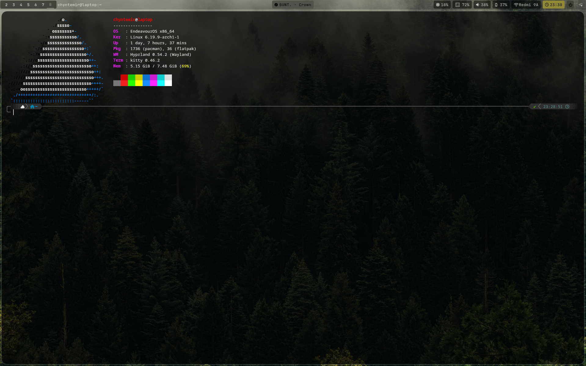
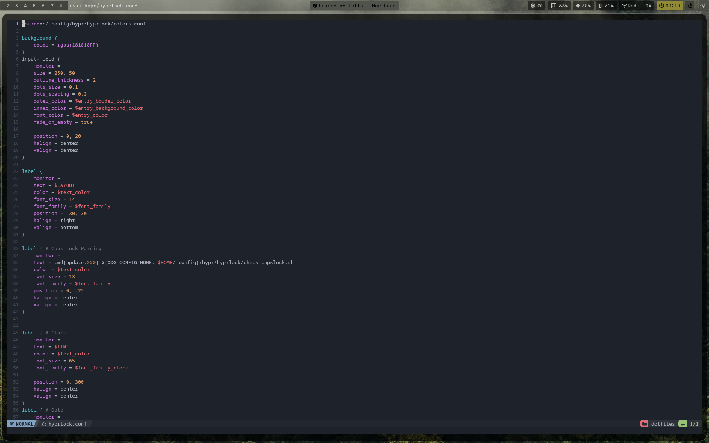
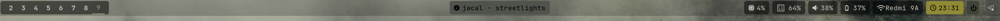

<h1 align="center">
  
  KowGen's Dotfiles
</h1>

<p align="center">
  <strong>Минималистичный Rice для эффективной работы и программирования</strong>
</p>

<p align="center">
  
  
  
  
</p>

---

## 📸 Скриншоты
> [!TIP]
> Здесь будет твой лучший скриншот! Положи его в папку `screenshots/` и укажи путь ниже.

<p align="center">
  
  
  
</p>

---

## 🛠️ Спецификации (Software Stack)

| Компонент    | Программа         | Описание                                |
| :----------- | :---------------- | :-------------------------------------- |
| **WM**       | **Hyprland**      | Динамический тайлинг и плавные анимации |
| **Терминал** | **Kitty**         | Быстрые эмуляторы с поддержкой лигатур  |
| **Редактор** | **Neovim**        | Кастомная сборка для Python/C/Rust      |
| **Панель**   | **Waybar**        | Лаконичные статус-бары                  |
| **Шелл**     | **ZSH**           | Умный автокомплит и кастомный промпт    |
| **Запуск**   | **Fuzzel / Rofi** | Быстрый поиск приложений                |

---

## ✨ Особенности системы

* ⌨️ **Hyprland**: Настроено под управление с меньшим использование мыши.
* 🦀 **NeoVim**: настроен и готов к работе из коробки.
* 🐧 **ZSH**: Использование юзабелити шелла.

---

## 🚀 Установка

> [!WARNING]
> Не копируйте конфиги вслепую! Сначала изучите содержимое файлов.

```bash
# Клонирование репозитория
git clone git@github.com:KowGen/dotfiles.git ~/dotfiles
cd ~/dotfiles

